<table width="100%">
<tr>
<td valign="top" width="50%"></td>
<td valign="top" width="50%"></td>
</tr>
</table>

---

<h2 align="center">About</h2>

I'm an **IT Developer & Student at 1337 KHG**, building a full-stack foundation in **JavaScript, Python, and Java**.

I'm currently strengthening core fundamentals — computer science, Linux, networking, and system programming — through the 1337 curriculum's project-based, peer-to-peer learning model.

I focus on writing clear, maintainable code and on understanding how systems work end to end — from the terminal to the browser.

---

<h2 align="center">Experience</h2>

**Web & Discord Developer — Holmes CodeLab** · 2024 — Present
Building and maintaining custom Discord bots and websites for communities and clients, covering everything from bot architecture to hosting and ongoing consulting.

**IT Development — 1337 KHG** · 2024 — Present
Peer-to-peer, project-based curriculum covering C, algorithms, system programming, and software engineering fundamentals.

---

| Category | Skills |
|----------|--------|
| **Programming Languages** |       |
| **Frontend** |        |
| **Backend** |     |
| **Databases** |    |
| **Operating Systems** |   |
| **Development Tools** |     |
| **Hosting & Deployment** |   |
| **Design** |   |

---

<h2 align="center">Featured Projects</h2>

<table>
<tr>
<td width="33%" valign="top" align="center">
<b>Multi-Purpose Discord Bot Framework</b> 
A modular Discord bot core (moderation, economy, tickets, AI chat) used to spin up custom bots for clients in minutes instead of days.  
    
<b>Achievement:</b> Powers multiple production bots serving thousands of members combined  
<a href="https://github.com/YahyaaB1">View on GitHub</a>
</td>
<td width="33%" valign="top" align="center">
<b>Holmes CodeLab Client Sites</b> 
Custom-built, high-performance websites delivered end-to-end for clients — design, deployment, and hosting.  
    
<b>Achievement:</b> Multiple sites shipped and live for real clients through Holmes CodeLab  
<a href="https://eagle-holmes.netlify.app/">View live</a>
</td>
<td width="34%" valign="top" align="center">
<b>AI-Assisted Automation Tools</b> 
Scripts and small services combining Python, APIs, and AI models to automate repetitive workflows for bots and websites.  
    
<b>Achievement:</b> Cuts manual setup time for new client projects significantly  
<a href="https://github.com/YahyaaB1">View on GitHub</a>
</td>
</tr>
</table>

---

<h2 align="center">Currently Learning</h2>

| Area | Focus |
|------|-------|
| **Computer Science** | Data structures, algorithms, clean code |
| **Linux** | Administration, shell scripting, the terminal workflow |
| **Networking** | OSI model, TCP/IP, HTTP/HTTPS, DNS |
| **Python** | Scripting, automation, deepening the language |
| **Docker** | Containers and containerized workflows |
| **Cloud** | Deployment concepts and core services |

---

<!-- contribution heatmap, refreshed daily by the workflow -->

  

  
<a href="https://eagle-holmes.netlify.app/"><b>Mr Holmes — Holmes CodeLab</b></a> 
Live status, badges & connections on my Holmes CodeLab profile

